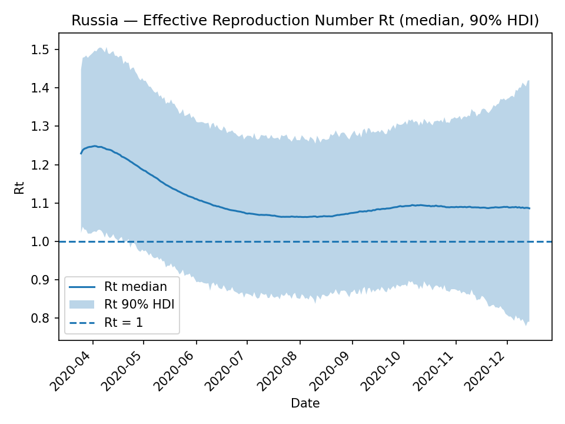
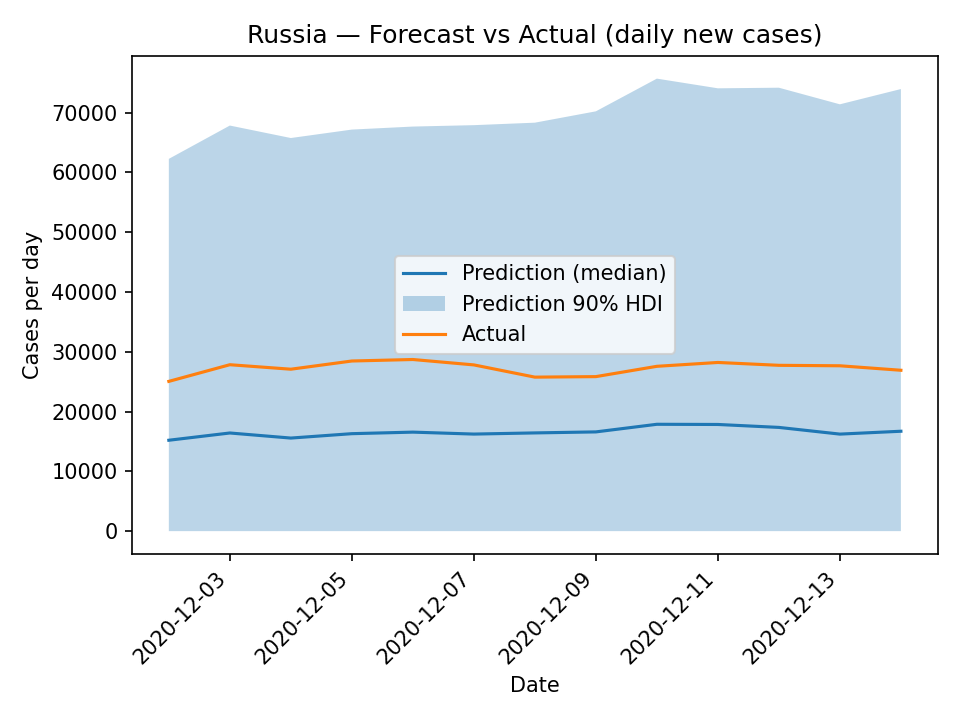
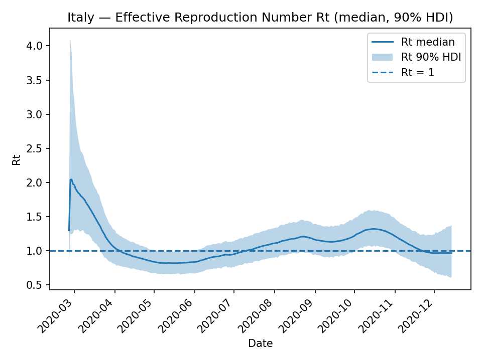
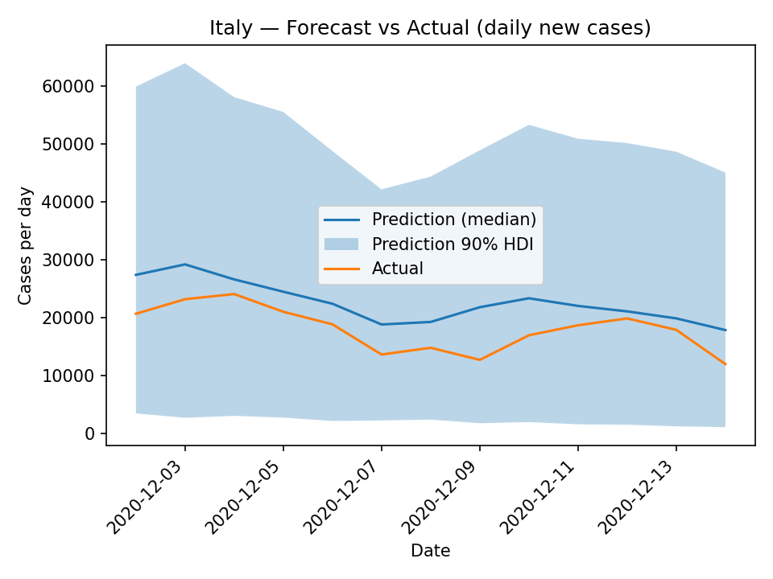
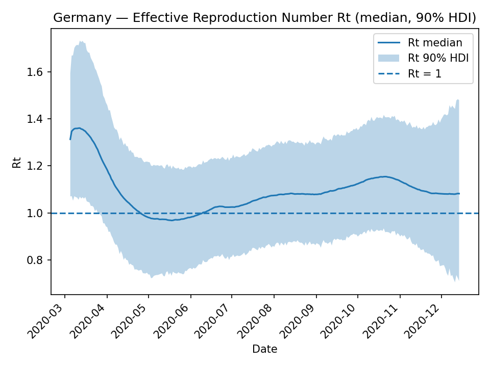
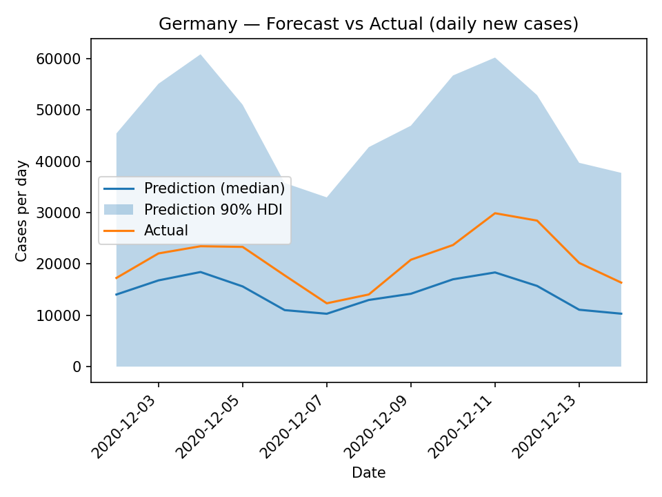
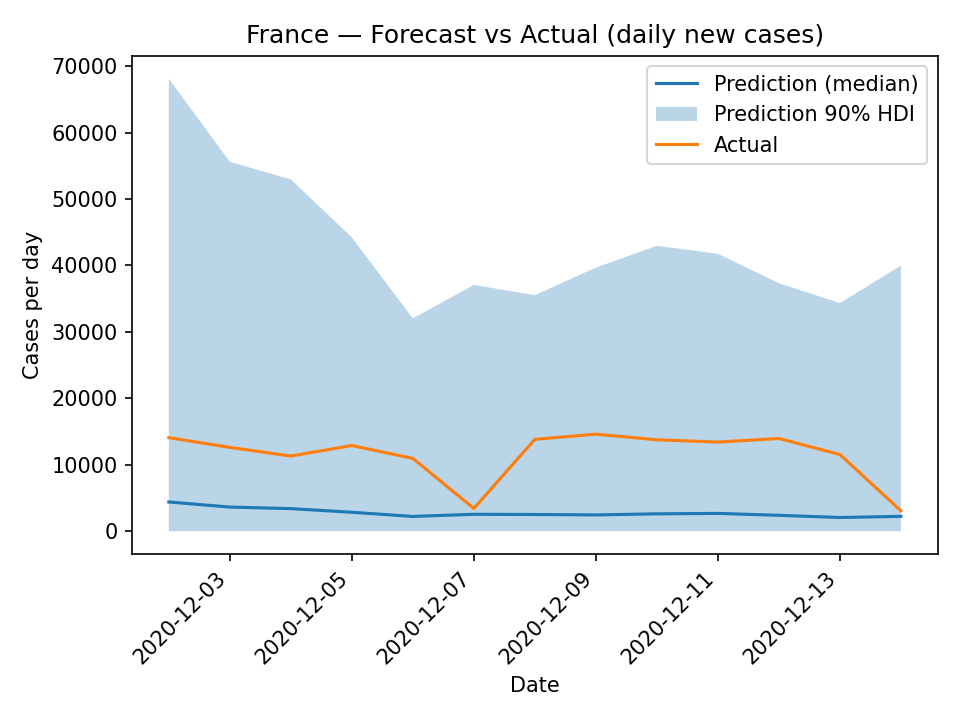

# Анализ динамики COVID-19 с использованием стохастической генеративной модели

## Описание проекта

Этот проект реализует стохастическую генеративную модель для анализа динамики COVID-19 с использованием библиотеки PyMC (версия > 3). Модель оценивает эффективное репродуктивное число R(t) и прогнозирует количество новых случаев заболевания.

### Основные возможности

- 📊 **Анализ репродуктивного числа R(t)** - оценка динамики передачи инфекции
- 🔮 **Прогнозирование заболеваемости** - предсказание количества новых случаев
- 🌍 **Мультистрановый анализ** - сравнение динамики в разных странах
- 📈 **Визуализация результатов** - графики и статистические отчеты
- 🎯 **Метрики качества** - оценка точности прогнозов

### Анализируемые страны

- 🇷🇺 **Россия** (Russia)
- 🇮🇹 **Италия** (Italy) 
- 🇩🇪 **Германия** (Germany)
- 🇫🇷 **Франция** (France)

### Временные периоды

- **Обучение модели**: 01.01.2020 - 01.12.2020
- **Прогнозирование**: 02.12.2020 - 14.12.2020
- **Пороговое значение**: анализ начинается после достижения 100 случаев в день

## Математическая модель

### Основные уравнения

```
log(R(t)) = log(R(t-1)) + ε(t), где ε(t) ~ Normal(0, σ_rw)
μ(t) = R(t) * Σ[w(s) * y(t-s)] для s от 1 до max_lag
y(t) ~ NegativeBinomial(μ(t), α)
```

### Ключевые параметры

- **R(t)** - эффективное репродуктивное число
- **σ_rw = 0.07** - стандартное отклонение случайного блуждания
- **α ~ LogNormal(log(60), 0.5)** - параметр дисперсии негативно-биномиального распределения
- **max_lag = 15** - максимальная задержка для учета инфекционности
- **Серийный интервал**: среднее = 4.0 дня, стандартное отклонение = 2.0 дня

## Результаты анализа

### Сводные метрики качества прогнозов

Данные из файла `outputs_rt_model/metrics_summary.csv`:

| Страна | MAE (Mean Absolute Error) | MAPE (%) (Mean Absolute Percentage Error) |
|--------|---------------------------|-------------------------------------------|
| 🇷🇺 Россия | 10,714.6 | 39.2% |
| 🇮🇹 Италия | 4,596.3 | 28.0% |
| 🇩🇪 Германия | 4,743.2 | 20.8% |
| 🇫🇷 Франция | 7,536.3 | 58.8% |

### Интерпретация результатов

- **Германия** показала лучшие результаты с MAPE = 20.8%, что указывает на высокую точность прогноза
- **Италия** демонстрирует хорошие результаты с MAPE = 28.0%
- **Россия** имеет умеренную ошибку прогноза (MAPE = 39.2%)
- **Франция** показывает наибольшую ошибку прогноза (MAPE = 58.8%), что может быть связано с особенностями динамики эпидемии в этой стране

## Графики результатов

### 🇷🇺 Россия (Russia)

#### Динамика репродуктивного числа R(t)


#### Прогноз vs фактические данные


### 🇮🇹 Италия (Italy)

#### Динамика репродуктивного числа R(t)


#### Прогноз vs фактические данные


### 🇩🇪 Германия (Germany)

#### Динамика репродуктивного числа R(t)


#### Прогноз vs фактические данные


### 🇫🇷 Франция (France)

#### Динамика репродуктивного числа R(t)


#### Прогноз vs фактические данные



## Установка и запуск

### Требования

```bash
pip install numpy pandas matplotlib scipy pymc pytensor
```

### Запуск анализа

```python
python solution.py
```

### Параметры запуска

- `run_fit=True` - полное обучение модели с MCMC сэмплированием
- `run_fit=False` - только построение модели без обучения (для тестирования)

## Технические детали
### Архитектура модели

1. **Стохастическое моделирование R(t)** — случайное блуждание в лог-пространстве.
2. **Учёт инфекционности** — взвешенная сумма случаев за предыдущие дни (серийный интервал).
3. **Негативно-биномиальная наблюдательная модель** — для овердисперсных дневных случаев.
4. **Байесовский вывод (MCMC)** — NUTS/HMC сэмплирует из апостериорного распределения.

### Алгоритм прогнозирования

1. Обучение модели на исторических данных.
2. Извлечение сэмплов траектории \(R(t)\) из апостериора.
3. Генерация прогнозов для каждого сэмпла (симуляция вперёд по renewal-ядру + NB-шум).
4. Агрегация: медиана и HDI-интервалы предиктивного распределения.

### Метрики качества

- **MAE (Mean Absolute Error)** — средняя абсолютная ошибка.
- **MAPE (Mean Absolute Percentage Error)** — средняя абсолютная процентная ошибка.
- **HDI (Highest Density Interval)** — интервалы наивысшей плотности (неопределённость).

---

## 1) Данные и подготовка

- Берём ежедневные **новые случаи** `new_cases` из OWID.
- Оставляем интервал:  
  **обучение** — `2020-01-01 … 2020-12-01` (train),  
  **прогноз** — `2020-12-02 … 2020-12-14` (forecast).
- Для каждой страны игнорируем дни до первого дня в train, когда случаев \( \ge 100 \).
- Получаем:
  - `y_obs` — массив наблюдений для обучения (после порога),
  - окно дат для прогноза.

---

## 2) Идея генеративной модели (renewal / «возобновление»)

Сегодняшние случаи моделируются как

$$
\mu_t \;=\; R_t \cdot \sum_{s=1}^{S} w_s \, y_{t-s},
$$

где \( \mu_t \) — ожидаемые случаи в день \( t \), \( R_t \) — эффективное репродуктивное число, \( w_s \) — веса серийного интервала, \( S \) — максимальная задержка (в коде `MAX_LAG = 15`).

**Серийный интервал** \( w_s \) получаем из гамма-распределения (по заданным mean/sd) и дискретизируем по дням, затем нормируем \( \sum_{s=1}^{S} w_s = 1 \).

---

## 3) Как мы описываем \( R_t \)

Случайное блуждание на логарифме:

$$
\log R_t \;=\; \log R_{t-1} + \varepsilon_t,\qquad
\varepsilon_t \sim \mathcal{N}(0,\sigma_{\text{rw}}^2).
$$

Начальное значение: \( \log R_0 \sim \mathcal{N}(\log 1.1,\,0.3^2) \). Положительность \( R_t \) обеспечивается экспонентой \( R_t=\exp(\log R_t) \).

---

## 4) Наблюдательная модель (овердисперсия)

Используем отрицательно-биномиальную модель:

$$
y_t \sim \operatorname{NegBinomial}(\mu_t,\alpha),\qquad
\mathbb{E}[y_t]=\mu_t,\quad \mathrm{Var}(y_t)=\mu_t+\frac{\mu_t^2}{\alpha}.
$$

Приор на овердисперсию: \( \log \alpha \sim \mathcal{N}(\log 60,\ 0.5^2) \) — чтобы предиктивные интервалы не раздувались из-за отчётного шума.

---

## 5) «История генерации» (generative story)

1) Сэмплируем гиперпараметры: \( \sigma_{\text{rw}}, \alpha, \log R_0 \).  
2) Генерируем траекторию \( \log R_t \) и \( R_t \).  
3) Считаем инфекционность \( \sum_s w_s \, y_{t-s} \).  
4) Получаем \( \mu_t = R_t \cdot \text{infectiousness}_t \).  
5) Наблюдения: \( y_t \sim \operatorname{NegBinomial}(\mu_t,\alpha) \).

На обучении **NUTS не максимизирует правдоподобие**, а **сэмплирует** из апостериорного распределения, пропорционального \( \text{likelihood} \times \text{priors} \).

---

## 6) Сэмплирование (Bayesian inference)

Используем NUTS (HMC) для получения апостериорных сэмплов параметров и кривой \( R_t \). Важные параметры: `chains`, `draws`, `tune`, `target_accept`.

---

## 7) Прогнозирование

Для каждого апостериорного сэмпла:

$$
\Lambda_t = \sum_{s=1}^{S} w_s \, \tilde y_{t-s},\qquad
\mu_t = R_t \cdot \Lambda_t,\qquad
\tilde y_t \sim \operatorname{NegBinomial}(\mu_t,\alpha),
$$

где \( \tilde y_{t-s} \) — «история» с учётом уже сгенерированных прогнозных значений. По облаку траекторий берём медиану и 90% HDI.

---

## 8) Метрики

MAE и MAPE:

$$
\mathrm{MAE}=\frac{1}{n}\sum_t \big|y_t-\hat y_t\big|,\qquad
\mathrm{MAPE}=\frac{100\%}{n}\sum_t \frac{\big|y_t-\hat y_t\big|}{\max(y_t,1)}.
$$

Рекомендуется также WAPE, sMAPE и метрики по сглаженному MA-7.


## Заключение

Проект демонстрирует применение современных методов байесовской статистики для анализа эпидемиологических данных. Модель успешно выявляет динамику репродуктивного числа R(t) и обеспечивает прогнозирование с количественной оценкой неопределенности.

### Ключевые выводы

1. **Германия** показала наиболее стабильную динамику эпидемии с лучшими прогнозами (MAPE = 20.8%)
2. **Италия** демонстрирует хорошие результаты прогнозирования (MAPE = 28.0%)
3. **Россия** имеет умеренную точность прогнозов (MAPE = 39.2%)
4. **Франция** показывает наибольшую сложность для прогнозирования (MAPE = 58.8%)
5. Модель эффективно улавливает основные тренды в динамике COVID-19
6. Байесовский подход обеспечивает надежную оценку неопределенности прогнозов

---

*Проект создан в рамках изучения стохастических генеративных моделей для анализа эпидемиологических данных*
